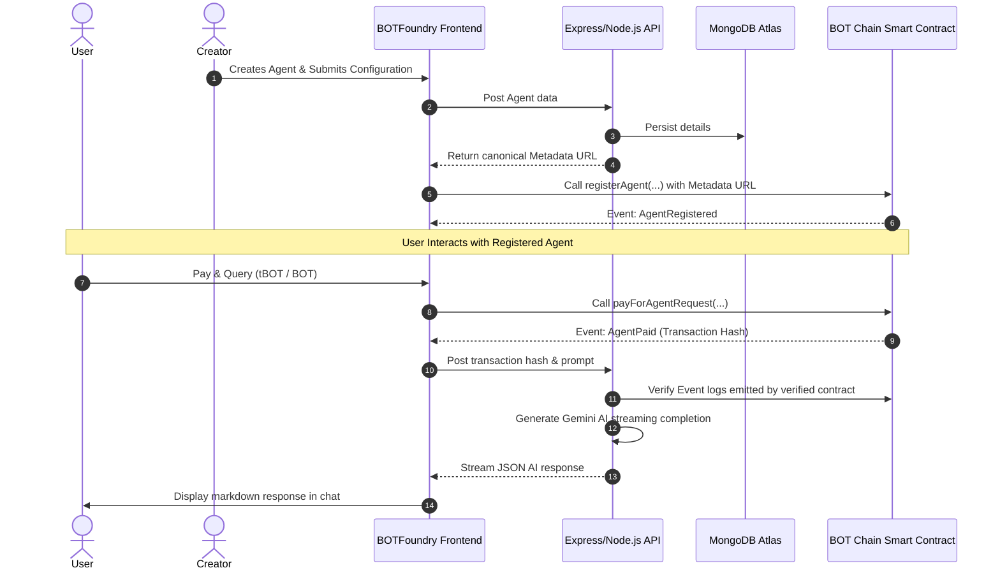
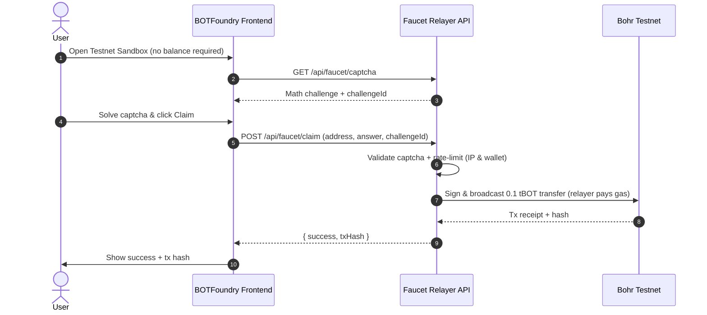

# 🤖 BOTFoundry

> The **"Vercel for AI Agents"** on the BOT Chain Layer-1 blockchain. Build, register, monetize, and execute autonomous AI agents with trustless on-chain micro-payments — now with a built-in **Solidity Studio** and **Gasless Testnet Faucet** for zero-friction onboarding.

---

## 📖 Overview

**BOTFoundry** is a decentralized platform designed to streamline the creation, deployment, and monetization of AI Agents. By combining the speed and security of **BOT Chain** smart contracts with state-of-the-art AI systems, BOTFoundry abstracts away blockchain complexities. Builders can turn simple system prompts and instructions into revenue-generating, Web3-connected AI assistants in under 60 seconds.

The platform is fully multi-network aware, supporting both **BOT Chain Mainnet** and **Bohr Testnet**, with strict data isolation between environments to prevent data contamination.

---

## 🛠 Deployed Smart Contracts

BOTFoundry runs on the official **BOT Chain** network and utilizes a robust pull-payment withdrawal structure to secure creator earnings and platform fees.

| Network | Chain ID | Contract Address |
| :--- | :--- | :--- |
| **BOT Chain Mainnet** | `677` | `0x380cD522A27B84d38E8988483da89660EcD8c141` |
| **BOT Chain Testnet** | `968` | `0x290EC24ed697A2ADb890F100499b615e83439e78` |

---

## 🚀 Key Features

* **No-Code Form Wizard**: Create and customize AI Agents with names, descriptions, categories, avatars, and specific system instructions without writing Solidity code.
* **On-Chain Micro-Payments**: Native billing integrated directly into the chat flow. Every agent execution triggers an on-chain verification check.
* **Fair Monetization Split**: Automatically routes payments — **95% to the Agent Creator** and **5% to the Platform Treasury**.
* **Secure Pull-Payment Architecture**: Creators and the platform treasury pull their accumulated earnings securely via the `withdraw()` pattern, eliminating Reentrancy and DoS attack vectors.
* **Modern Chat UX**: Features a responsive unboxed chat layout, floating glassmorphic input, multiline input, and full code-highlighting markdown support with copy actions.
* **Creator Telemetry & Dashboard**: Real-time stats showing agent installs, total requests processed, and revenue generated (with background polling).
* **Solidity Studio (Sandbox)**: A fully integrated browser-based Solidity development environment. Write, AI-generate, compile (via backend Solidity compiler), and deploy contracts to Testnet or Mainnet without leaving the platform. Includes a deployment history panel and an interactive contract console for calling contract functions post-deployment.
* **BohrFaucet System**: Developers can deploy standardized `BohrFaucet` contracts and list them in the public directory. The platform maintains a community directory of active testnet faucets.
* **Gasless Testnet Faucet (Relayer)**: New users can claim **0.1 tBOT** instantly without any gas fees or existing balance. The BOTFoundry backend relayer wallet sponsors the gas cost and transfers tokens directly. Protected by math-based CAPTCHA verification and 24-hour per-IP / per-wallet rate-limiting to prevent Sybil attacks.

---

## 📐 Architecture Flow



### Gasless Faucet Relayer Flow



---

## 💻 Tech Stack

* **Smart Contracts**: Solidity, Foundry (Forge test environment).
* **Frontend**: React, Vite, TypeScript, Tailwind CSS v4, Framer Motion, Lucide Icons.
* **Backend**: Node.js, Express, Ethers.js (v6), Mongoose (MongoDB).
* **AI Model**: Google Gemini API.
* **Solidity Compiler**: `solc-js` (server-side compilation via backend endpoint).

---

## ⚙ Getting Started

### 1. Prerequisites
* Node.js (v18+)
* MongoDB (Local instance or Atlas connection string)
* MetaMask or any Web3 wallet configured with the BOT Chain RPC parameters.

### 2. Environment Variables

Create a `.env` file in the **backend directory** matching the template:

#### Backend (`backend/.env`):
```env
PORT=5000
MONGO_URI=mongodb://localhost:27017/botfoundry
GEMINI_API_KEY=your_gemini_api_key

# Gasless Faucet Relayer
# Fund this wallet with tBOT on Bohr Testnet before activating the faucet.
# If omitted, the server auto-generates a temporary wallet and logs the address.
FAUCET_PRIVATE_KEY=your_faucet_relayer_private_key
```

#### Contracts (`contracts/.env`):
```env
PRIVATE_KEY=your_deployer_private_key
RPC_URL=https://rpc.botchain.ai/
TREASURY_ADDRESS=your_treasury_payout_address
```

### 3. Funding the Gasless Faucet Relayer

To activate the Gasless Testnet Faucet:
1. Set `FAUCET_PRIVATE_KEY` in `backend/.env` to a funded testnet wallet's private key.
2. Ensure the wallet holds enough `tBOT` to cover claims (each claim sends **0.1 tBOT** to a new user).
3. Restart the backend server — the relayer activates automatically.

> **Note**: If `FAUCET_PRIVATE_KEY` is not set, the server auto-generates a temporary wallet, logs its address, and waits to be funded. The faucet will return errors until funded.

### 4. Installation & Local Development

Install workspace dependencies and start both backend and frontend servers:

```bash
# Install root, backend, and frontend dependencies
npm install

# Start the Backend API server (runs on Port 5000)
npm run dev:backend

# Start the Frontend React application (runs on Port 5173)
npm run dev:frontend
```

---

## 🔬 Solidity Studio (Sandbox)

The **Sandbox** tab provides a full in-browser Solidity development environment:

| Feature | Description |
| :--- | :--- |
| **AI Code Generator** | Describe your contract in plain English and let Gemini generate Solidity code. |
| **Browser Editor** | Syntax-highlighted Solidity editor with live editing. |
| **Backend Compiler** | Compiles Solidity via `solc-js` on the server. Displays typed error output for debugging. |
| **AI Fix Helper** | Click "Help Fix with AI" on any compiler error to automatically patch the code. |
| **One-Click Deploy** | Deploys compiled bytecode to Testnet or Mainnet using the connected MetaMask wallet. |
| **Deployment History** | Saves all past deployments keyed by wallet address in `localStorage`. Reload any previous contract into the console with one click. |
| **Interactive Console** | Call any ABI function (read or write) on a deployed contract directly from the browser. |
| **Public Faucet Directory** | Lists all community-deployed `BohrFaucet` contracts on the current network. |
| **Gasless Claim** | Testnet faucets integrate the relayer flow — users solve a CAPTCHA and click Claim; no gas required. |

---

## 🔒 Security Audits

The smart contracts are audited and built with high standards:
* **Checks-Effects-Interactions**: Followed strictly to prevent reentrancy exploits.
* **Pull-over-Push payments**: Contract balances are claimed rather than transferred dynamically, preventing contract execution locks from gas exhaustion or bad receivers.
* **Strict Event verification**: The backend checks transaction receipts against event logs emitted solely by the registry contract, eliminating counterfeit log verification vectors.

### Gasless Faucet Security
* **Math CAPTCHA**: Server-side challenge/response with a 5-minute expiry and single-use enforcement to block automated scripts.
* **Dual Rate Limiting**: Separate 24-hour cooldowns tracked per **IP address** and per **wallet address** stored in server memory.
* **Key Isolation**: The `FAUCET_PRIVATE_KEY` is used solely for faucet disbursement and holds no platform treasury or creator earnings.
