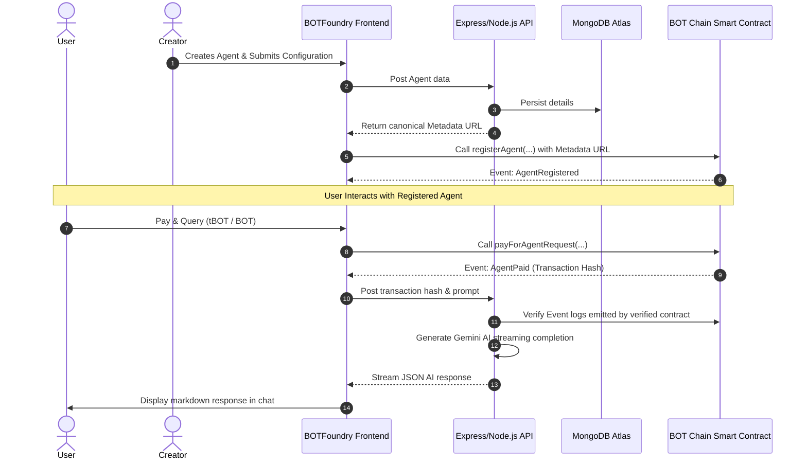

# 🤖 BOTFoundry

> The **"Vercel for AI Agents"** on the BOT Chain Layer-1 blockchain. Build, register, monetize, and execute autonomous AI agents with trustless on-chain micro-payments.

---

## 📖 Overview

**BOTFoundry** is a decentralized platform designed to streamline the creation, deployment, and monetization of AI Agents. By combining the speed and security of **BOT Chain** smart contracts with state-of-the-art AI systems, BOTFoundry abstracts away blockchain complexities. Builders can turn simple system prompts and instructions into revenue-generating, Web3-connected AI assistants in under 60 seconds.

---

## 🛠 Deployed Smart Contracts

BOTFoundry runs on the official **BOT Chain** network and utilizes a robust pull-payment withdrawal structure to secure creator earnings and platform fees.

| Network | Chain ID | Contract Address |
| :--- | :--- | :--- |
| **BOT Chain Mainnet** | `677` | `0x380cD522A27B84d38E8988483da89660EcD8c141` |
| **BOT Chain Testnet** | `968` | `0x290EC24ed697A2ADb890F100499b615e83439e78` |

---

## 🚀 Key Features

* **No-Code Form Wizard**: Create and customize AI Agents with names, descriptions, categories, avatars, and specific system instructions without writing solidity code.
* **On-Chain Micro-Payments**: Native billing integrated directly into the chat flow. Every agent execution triggers an on-chain verification check.
* **Fair Monetization Split**: Automatically routes payments: **95% to the Agent Creator** and **5% to the Platform Treasury**.
* **Secure Pull-Payment Architecture**: Creators and the platform treasury pull their accumulated earnings securely via the `withdraw()` pattern, eliminating Reentrancy and DoS attack vectors.
* **Modern Chat UX**: Features a responsive unboxed chat layout, floating glassmorphic input, multiline input, and full code-highlighting markdown support with copy actions.
* **Creator Telemetry & Dashboard**: Real-time stats showing agent installs, total requests processed, and revenue generated (with background polling).

---

## 📐 Architecture Flow



---

## 💻 Tech Stack

* **Smart Contracts**: Solidity, Foundry (Forge test environment).
* **Frontend**: React, Vite, TypeScript, Tailwind CSS, Framer Motion, Lucide Icons.
* **Backend**: Node.js, Express, Ethers.js (v6), Mongoose (MongoDB).
* **AI Model**: Google Gemini API.

---

## ⚙ Getting Started

### 1. Prerequisites
* Node.js (v18+)
* MongoDB (Local instance or Atlas connection string)
* MetaMask or any Web3 wallet configured with the BOT Chain RPC parameters.

### 2. Environment Variables

Create a `.env` file in the **root directory**, **backend directory**, and **contracts directory** matching the templates:

#### Root & Backend (`backend/.env`):
```env
PORT=5000
MONGO_URI=mongodb://localhost:27017/botfoundry
GEMINI_API_KEY=your_gemini_api_key
```

#### Contracts (`contracts/.env`):
```env
PRIVATE_KEY=your_deployer_private_key
RPC_URL=https://rpc.botchain.ai/
TREASURY_ADDRESS=your_treasury_payout_address
```

### 3. Installation & Local Development

Install workspace dependencies and start both backend and frontend servers:

```bash
# Install root, backend, and frontend dependencies
npm install

# Start the Backend API server (runs on Port 5000)
npm run dev:backend

# Start the Frontend React application (runs on Port 5173)
npm run dev:frontend
```

---

## 🔒 Security Audits

The smart contracts are audited and built with high standards:
* **Checks-Effects-Interactions**: Followed strictly to prevent reentrancy exploits.
* **Pull-over-Push payments**: Contract balances are claimed rather than transferred dynamically, preventing contract execution locks from gas exhaustion or bad receivers.
* **Strict Event verification**: The backend checks transaction receipts against event logs emitted solely by the registry contract, eliminating counterfeit log verification vectors.
